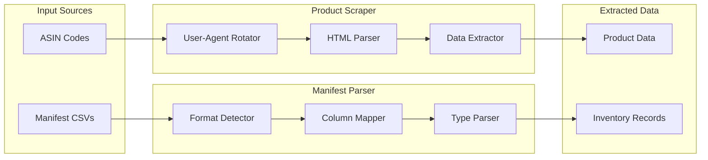

# Amazon Product Scraper

**Resilient Amazon product scraper with ASIN lookup, user-agent rotation, and liquidation manifest CSV parser for bulk operations.**


---

## What it does

Two complementary tools for Amazon product data extraction:

**1. Product Scraper** — Given an ASIN, extracts title, hi-res images, price, and feature bullet points from Amazon product pages. Handles user-agent rotation, HTTP error codes (404, 503), timeouts, and graceful degradation when fields are unavailable.

**2. Manifest Parser** — Parses Amazon liquidation manifest CSVs (from B-Stock, Amazon Warehouse, etc.) with automatic column detection across 35+ naming variations. Extracts batch IDs from filenames, handles type coercion, and processes entire directories.

Built from a production system that scraped **10,000+ products** for a multi-marketplace resale operation.

## Architecture



## Features

### Product Scraper
- **Multi-domain support** — amazon.es, amazon.com, amazon.co.uk, amazon.de, amazon.fr, amazon.it
- **User-agent rotation** — Pool of 8+ agents with usage tracking, extensible via JSON file
- **Hi-res image extraction** — Regex on page source for full-resolution images, fallback to landing image
- **HTTP status tracking** — Every response includes `_status` (200, 404, 503) for upstream retry logic
- **Graceful degradation** — Missing price, features, or images don't fail the entire scrape
- **Configurable timeouts** — Per-instance timeout settings

### Manifest Parser
- **Auto-format detection** — Reads CSV headers and maps 35+ column name variations (spaces, underscores, mixed case)
- **Batch ID extraction** — Parses `A2Z43836` from filenames automatically
- **Type coercion** — Handles int, float, bool, date with multiple format support
- **Directory processing** — Parse all CSVs in a folder in one call
- **Statistics tracking** — Files processed, rows parsed, errors encountered

## Quick start

```bash
git clone https://github.com/AspiranteD/amazon-product-scraper.git
cd amazon-product-scraper
pip install -r requirements.txt
```

### Scrape a product

```bash
python examples/scrape_single.py B08N5WRWNW
python examples/scrape_single.py B08N5WRWNW --domain com
```

### Parse a manifest

```bash
python examples/parse_manifest.py path/to/A2Z43836.csv
python examples/parse_manifest.py path/to/manifests/     # entire directory
```

### Run tests

```bash
pytest tests/ -v
```

## Usage

### Scraper

```python
from src.scraper import AmazonScraper, UserAgentRotator

rotator = UserAgentRotator()
scraper = AmazonScraper(user_agents=rotator.get_all(), domain="es")

result = scraper.scrape_product("B08N5WRWNW")
# {
#   "_status": 200,
#   "title": "Sony WH-1000XM4 - Auriculares inalámbricos...",
#   "images": "https://images-na.ssl.../71abc.jpg|https://...",
#   "price": 279,
#   "features": "Cancelación de ruido\n30h de batería\n..."
# }

if result is None:
    print("Network error")
elif result["_status"] == 404:
    print("Product not found")
elif result["_status"] == 503:
    print("Bot detection - retry later")
```

### Manifest parser

```python
from src.manifest import ManifestParser

parser = ManifestParser()

# Single file
rows = parser.parse_file("data/A2Z43836.csv")

# Entire directory
rows = parser.parse_directory("data/manifests/")

# Work with parsed data
for row in rows:
    if row.has_asin():
        print(f"{row.lpn}: {row.asin} - ${row.retail_value():.2f}")

print(parser.get_stats())
# {"files_processed": 5, "rows_parsed": 4200, "rows_failed": 3, "files_failed": 0}
```

## Project structure

```
amazon-product-scraper/
├── src/
│   ├── scraper/
│   │   ├── amazon_scraper.py    # Core ASIN scraper
│   │   └── user_agents.py       # UA rotation with tracking
│   └── manifest/
│       ├── parser.py            # CSV parser with auto-detection
│       └── models.py            # ManifestRow dataclass
├── tests/
│   ├── test_scraper.py          # 9 tests - HTTP mocking
│   ├── test_manifest_parser.py  # 11 tests - CSV parsing
│   └── test_user_agents.py      # 6 tests - rotation logic
├── examples/
│   ├── scrape_single.py         # CLI: scrape one ASIN
│   └── parse_manifest.py        # CLI: parse manifest CSVs
└── requirements.txt
```

## Design decisions

**Why HTML scraping instead of Amazon's official SP-API?**
SP-API requires seller account approval, complex OAuth, and has restrictive rate limits. For a liquidation resale operation processing returned goods, you often don't have SP-API access to the original seller's catalog. HTML scraping with proper rate limiting and user-agent rotation is the pragmatic solution.

**Why a separate manifest parser?**
Amazon liquidation manifests come in wildly inconsistent CSV formats — column names change between batches, some use spaces, some underscores, some have extra columns. A robust parser that handles 35+ column variations saves hours of manual data cleaning per truckload.

**Why track HTTP status instead of raising exceptions?**
Upstream callers (batch processors, enrichment pipelines) need to distinguish between "product doesn't exist" (404 — stop retrying), "bot detection" (503 — back off and retry), and "network error" (None — retry immediately). Exceptions lose this nuance.

## Built with

- **Python 3.11+** — Type hints, dataclasses
- **requests** — HTTP client with timeout support
- **BeautifulSoup4** — HTML parsing
- **pytest** — Unit tests with HTTP mocking

## Part of a larger system

This scraper feeds data into the [AI Product Enrichment Pipeline](https://github.com/AspiranteD/ai-product-enrichment), which categorizes products and generates marketplace-ready listings using OpenAI.

## License

MIT
